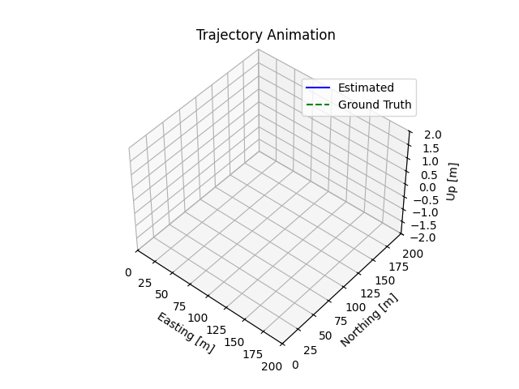

## Autonomous Vehicle State Estimation
A sensor fusion pipeline for autonomous vehicle localization using Extended Kalman Filter (EKF). This project combines IMU, GPS, and LIDAR data to estimate vehicle position, velocity, and orientation in real-time.

Overview
This project implements a complete state estimation system that fuses multiple sensor inputs to track a vehicle's 9 degrees of freedom:

- Position (x, y, z)
- Velocity (vx, vy, vz)
- Orientation (roll, pitch, yaw)

The system uses an Extended Kalman Filter to intelligently combine sensor data, handling uncertainties and maintaining accuracy even when individual sensors fail or provide conflicting information.


## Key Features

- Multi-sensor fusion: Combines IMU, GPS, and LIDAR measurements
- Real-time state estimation: Tracks position, velocity, and orientation
- Sensor calibration: Handles coordinate frame transformations (LIDAR-to-IMU)
- Uncertainty quantification: Tracks estimation confidence through covariance propagation
- Robust performance: Maintains accuracy during sensor dropouts
- Ground truth comparison: Includes performance analysis and error visualization

## Technical Implementation
Extended Kalman Filter (EKF)

- Motion Model: Integrates IMU acceleration and angular velocity with gravity compensation
- Measurement Model: Processes GPS and LIDAR position updates
- Prediction Step: Propagates state estimates using IMU data
- Update Step: Corrects predictions using GPS/LIDAR measurements

Sensor Processing

- IMU: High-frequency acceleration and angular velocity data for motion prediction
- GPS: Global position reference with noise modeling
- LIDAR: Precise local positioning after coordinate frame transformation

## Results
The system successfully demonstrates:

- Accurate trajectory tracking compared to ground truth
- Robust performance through sensor challenging conditions
- Proper uncertainty estimation and error bounds
- Real-time state estimation suitable for autonomous vehicle applications

## Dependencies

- Python 3.x
- NumPy
- Matplotlib
- Pickle (for data loading)
- Custom rotation utilities (rotations.py)

## Usage
```python
python es_ekf.py
```
The script will:

- Load sensor data from pickle files
- Initialize the EKF with ground truth starting conditions
- Process sensor measurements through the main filter loop
- Generate trajectory plots and error analysis
- Output final state estimates for evaluation

Data Format
The project uses pickle files containing:

- Ground Truth: Position, velocity, orientation with timestamps
- IMU Data: Specific force and angular velocity measurements
- GPS Data: Global position measurements
- LIDAR Data: Local position estimates (transformed to IMU frame)

## Applications
This technology forms the foundation for:

- Autonomous vehicle navigation systems
- Advanced Driver Assistance Systems (ADAS)
- Robotics localization
- Any application requiring precise real-time state estimation from multiple sensors

Future Enhancements

- Integration with SLAM algorithms
- Support for additional sensor types
- Advanced motion models for different vehicle dynamics
- Real-time implementation optimizations


This project demonstrates the core sensor fusion techniques used in modern autonomous vehicles like Tesla Autopilot and Waymo's self-driving systems.
